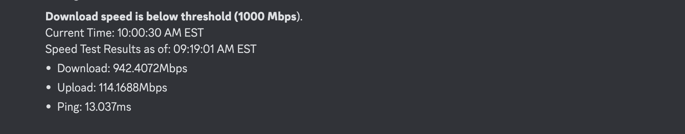

# Speedtest Tracker Discord Notifications

This Python script is designed to work with [alexjustesen/speedtest-tracker](https://github.com/alexjustesen/speedtest-tracker), which currently doesn't support Discord notifications. It allows you to send speed test results to a Discord webhook bot. You can use this script to keep track of your network's speed test results and receive notifications in your Discord server.

## Prerequisites

Before using this script, make sure you have the following:

- [Speedtest Tracker](https://github.com/alexjustesen/speedtest-tracker) installed and running. It is easy to setup via `docker-compose` ([Example compose file here](example-docker-compose.yml))
- A Discord webhook URL where you want to send the notifications.
- Python 3.x installed on your system.
- The required Python packages installed, which can be installed using `pip3`:
  - `requests`
  - `dateutil`

## Configuration

Open the script (`discord-notify.py`) and configure the following variables at the top of the script:

- `GITHUB_WEBHOOK_URL`: Replace 'YOURWEBHOOKURL' with your Discord webhook URL where you want to send the notifications.

- `TARGET_TIMEZONE`: Specify your timezone (e.g., 'EST'). This is used to convert the timestamp from UTC to your local timezone.

- `THRESHOLD_DOWNLOAD`, `THRESHOLD_UPLOAD`, and `THRESHOLD_PING`: You can set these thresholds to control when notifications are sent. Each threshold corresponds to a specific metric:
  - `THRESHOLD_DOWNLOAD`: Set your download threshold in Mbps (0 to disable).
  - `THRESHOLD_UPLOAD`: Set your upload threshold in Mbps (0 to disable).
  - `THRESHOLD_PING`: Set your ping threshold in ms (0 to disable).

Here's how the thresholds work:
- If all threshold values are set to 0, the script will send notifications regardless of the speed test results.
- If one or more thresholds are enabled (set to a value greater than 0), the script will only notify you if the corresponding thresholds are met.

## Usage

1. Ensure that the Speedtest Tracker is running and collecting speed test data.

2. Run the script by executing the following command in your terminal:

   ```shell
   python3 speedtest_discord_notifier.py
    ```

This will fetch the latest speed test results from Speedtest Tracker, parse them, and send them to the configured Discord webhook.

The message will contain the current time, the time of the speed test result, and the speed test details (download speed, upload speed, and ping).

If you have set thresholds it will also display if any thresholds have been met

# Example Discord Notification

Here is an example of what the Discord notification message might look like with no thresholds:


And here is what it might look like with thresholds:



# Scheduling

Now you can keep track of your network's speed test results in your Discord server and receive notifications whenever new results are available via a cron job.

See [this calculator](https://crontab.guru/) to create your cron schedule syntax

Example:

`crontab -e`

```bash
5 * * * * python3 /path/to/your/speedtest-notify.py
```

# Issues/ Feature Requests
Submit an issue if you have any problems or feature requests.